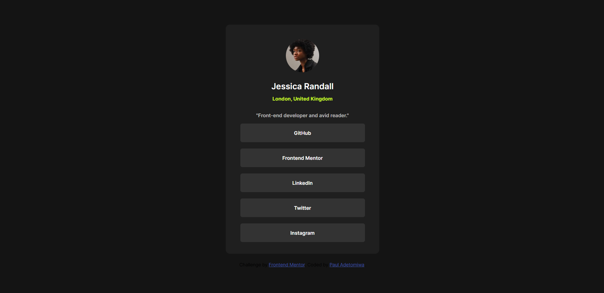

# Frontend Mentor - Social links profile solution

This is a solution to the [Social links profile challenge on Frontend Mentor](https://www.frontendmentor.io/challenges/social-links-profile-UG32l9m6dQ). Frontend Mentor challenges help you improve your coding skills by building realistic projects.

## Table of contents

- [Overview](#overview)
  - [Screenshot](#screenshot)
  - [Links](#links)
- [My process](#my-process)
  - [Built with](#built-with)
  - [What I learned](#what-i-learned)
- [Author](#author)


## Overview

- This is a solution to a social links profile challenge on Frontend Mentor. Involves using HTML and CSS only to create a social profile link list with a brief description of its author. 

### Screenshot



### Links

- https://github.com/PaulAdetomiwa/social-links-profile/blob/main/index.html

## My process

### Built with

- Semantic HTML5 markup
- CSS custom properties
- CSS Grid

### What I learned

```html
<div class="second_half">
      <a href="https://github.com/PaulAdetomiwa">GitHub</a>
      <a href="https://www.frontendmentor.io/profile/PaulAdetomiwa">Frontend Mentor</a>
      <a href="https://www.linkedin.com/in/paul-adewole/">LinkedIn</a>
      <a href="https://x.com/AdewolePaul6">Twitter</a>
      <a href="https://www.instagram.com/paul_adetomiwa/">Instagram</a>
    </div>
```
- This part carries most of the webpage. It's just a couple of links that have been designed using CSS, and connect to the websites that they indicate.

```css
.second_half a {
      color: hsl(0, 0%, 100%);
      font-size: 12px;
      font-weight: 500;
      background-color: hsl(0, 0%, 20%);
      height: 30px;
      width: 300px;
      text-align: center;
      padding-top: 15px;
      border-radius: 5px;
      border: 0;
      margin: 0;
      text-decoration-line: none;
    }

    .second_half a:hover {
      background-color: hsl(75, 94%, 57%);
      cursor: pointer;
      color: hsl(0, 0%, 12%);
    }
```
- This covers all the customization of the links. It also changes background and text color and cursor when hovering on the links. 

- I also set a minimum height for the body to ensure responsiveness. 

## Author

- Website - [Paul Adetomiwa](https://github.com/PaulAdetomiwa)
- Frontend Mentor - [@PaulAdetomiwa](https://www.frontendmentor.io/profile/PaulAdetomiwa)
- X - [@AdewolePaul6](https://www.x.com/AdewolePaul6)